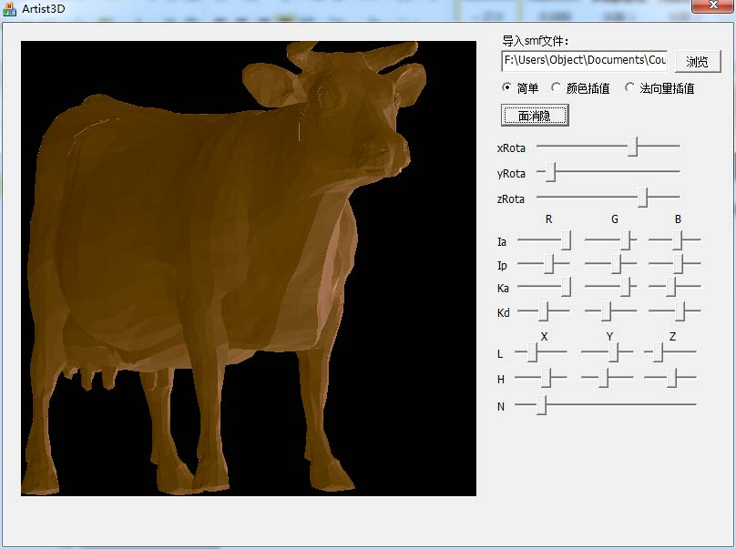
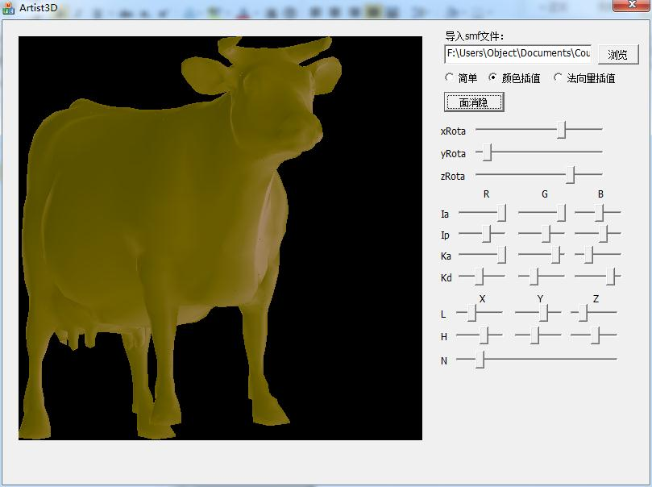

PhongLighting
=============

Phong lighting algorithm demo

### Case 1: Phong simple ###

1. Select a file
2. Select "简单" (simple)
3. Set the parameters
4. Press "面消隐" (Hidden-Surface Removal)

And it display like this:

### Case 2: Phone on color interpolation ###

1. Select a file
2. Select "颜色插值" (color interpolation)
3. Set the parameters
4. Press "面消隐" (Hidden-Surface Removal)

And it display like this:

### Case 3: Phone on normal vector interpolation ###

1. Select a file
2. Select "法向量插值" (normal vector interpolation)
3. Set the parameters
4. Press "面消隐" (Hidden-Surface Removal)

And it display like this:

